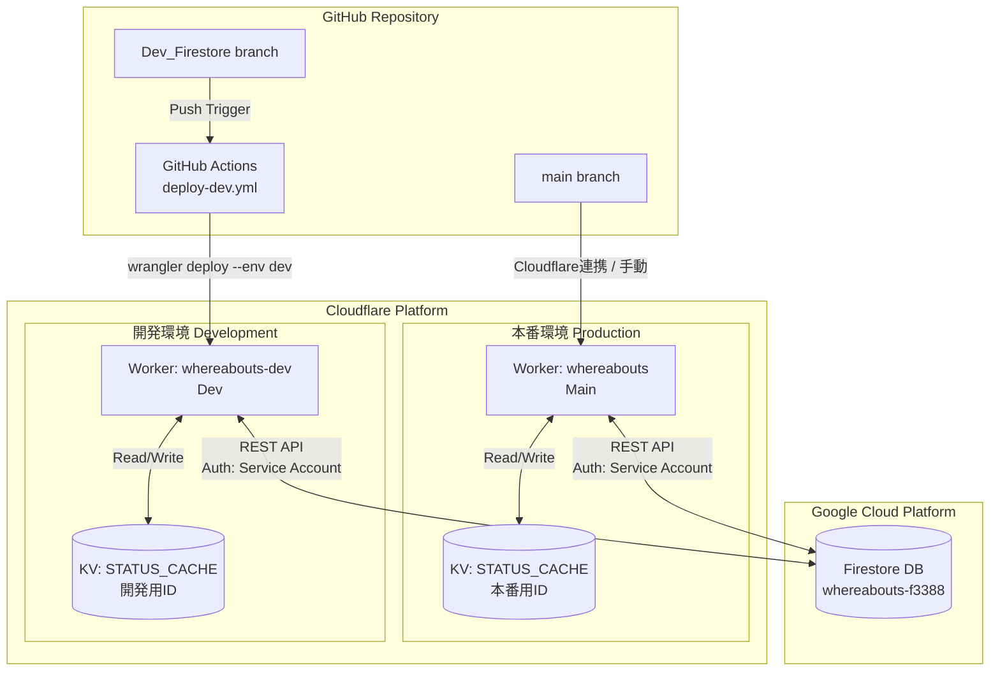

# システムアーキテクチャ・環境分離仕様書

## 1. 概要

本システム「在席ボード（Whereabouts）」は、Cloudflare Workers をバックエンド（BFF: Backend For Frontend）、Cloudflare Workers KV をキャッシュ層、Google Cloud Firestore を永続データベースとして構成されています。

開発の安全性と効率性を高めるため、GitHub のブランチ戦略と連携し、**本番環境（Production）** と **開発環境（Development）** が完全に分離された状態で稼働しています。

---

## 2. システム構成図

以下の図は、GitHub でのコード管理からデプロイ、そして稼働時のデータフローを示しています。



---

## 3. 環境分離の定義

`wrangler.toml` および GitHub Actions の設定に基づき、各環境のリソースは以下のように定義されています。

| 項目 | 本番環境 (Production) | 開発環境 (Development) |
|------|----------------------|------------------------|
| **GitHubブランチ** | `main` | `Dev_Firestore` |
| **Cloudflare Worker名** | `whereabouts` | `whereabouts-dev` |
| **アクセスURL** | `https://whereabouts...` | `https://whereabouts-dev...` |
| **KV Namespace** | 本番用 (`cc4d...`) | 開発用 (`695b...`) |
| **デプロイ契機** | Cloudflare Git連携 / 手動 | GitHub Actions (push) |
| **接続データベース** | `whereabouts-f3388` | `whereabouts-f3388` (共有*) |

> **(*) データベースの共有について**  
> Firestore のデータベースインスタンスは共有していますが、KV（キャッシュ）が完全に分離されているため、開発中のデータ構造変更などが本番環境の表示に影響を与えることはありません。

---

## 4. コンポーネント連携詳細

### A. GitHub ➔ Cloudflare (デプロイ連携)

ソースコードの変更を検知し、適切な環境へデプロイします。

#### 🔧 開発環境へのデプロイ

- **設定ファイル**: `.github/workflows/deploy-dev.yml`
- **トリガー**: `Dev_Firestore` ブランチへの Push
- **動作**: `wrangler deploy --env dev` コマンドを実行し、`wrangler.toml` 内の `[env.dev]` ブロックの設定を適用してデプロイします
- **認証**: GitHub Secrets に登録された `CLOUDFLARE_API_TOKEN` を使用

#### 🚀 本番環境へのデプロイ

- **トリガー**: `main` ブランチへのマージ
- **動作**: Cloudflare 管理画面の Git 連携、または手動デプロイにより更新されます

---

### B. Cloudflare ➔ Firestore (データ通信)

Workers から Firestore へのアクセスは、SDK ではなく **REST API** を使用して軽量化を図っています。

#### 🔐 認証フロー (`CloudflareWorkers_worker.js`)

1. 環境変数 `FIREBASE_PRIVATE_KEY` (秘密鍵) と `FIREBASE_CLIENT_EMAIL` を読み込み
2. Workers 内で JWT (JSON Web Token) を生成・署名
3. Google OAuth2 エンドポイントでアクセストークンを取得
4. 取得したトークンをヘッダーに付与して Firestore REST API を実行

#### 📡 通信方式

- **通常の読み書き**: `documents` エンドポイントへの `GET`/`PATCH`
- **差分取得（実装予定）**: `runQuery` エンドポイントへの `POST` (StructuredQuery)

---

### C. Cloudflare ➔ KV (キャッシュ戦略)

読み取り負荷の軽減と高速化のため、Workers KV を活用しています。

#### 🔒 分離の重要性

`wrangler.toml` にて、本番用と開発用で異なる `id` を指定しています。これにより、開発環境でキャッシュ汚染（互換性のないデータ構造の保存など）が発生しても、本番環境には一切影響しません。

#### 💾 キャッシュ対象

- **getConfig**: メンバーリストや設定情報
- **get**: 在席状況データ（全件取得時のみ）

---

## 5. フロントエンドの接続設定

クライアントサイド（ブラウザ）の JavaScript も、コードベースは共通ですが設定値によって接続先が変わります。

### `js/config.js`

`remoteEndpoint` 変数にて接続先の Worker URL を指定。開発ブランチ (`Dev_Firestore`) では `-dev` 付きの URL が設定されています。

```javascript
// js/config.js (Devブランチの例)
const CONFIG = {
    remoteEndpoint: "https://whereabouts-dev.taka-hiyo.workers.dev",
    // ...
};
```

---

## 6. 開発ワークフロー

### 📝 実装・修正
`Dev_Firestore` ブランチにてコードを変更

### ⚙️ 自動デプロイ
GitHub へ Push すると、Actions が起動し `whereabouts-dev` が更新される

### ✅ 動作確認
開発環境 URL (`https://whereabouts-dev...`) にアクセスして確認。KV が独立しているため、データ構造の変更などを安全に試行可能

### 🚀 本番反映

1. `Dev_Firestore` を `main` にマージ
2. `js/config.js` の接続先が本番 URL になっていることを確認
3. 本番環境へデプロイ

---

## 📌 まとめ

本システムは、**完全に分離された開発環境と本番環境**により、安全かつ効率的な開発サイクルを実現しています。

- ✅ GitHub ブランチ戦略による明確な環境分離
- ✅ Cloudflare Workers + KV による高速かつスケーラブルなアーキテクチャ
- ✅ Firestore REST API による軽量な認証・データアクセス
- ✅ GitHub Actions による自動デプロイで開発効率を向上

この構成により、開発者は本番環境への影響を気にすることなく、新機能の実装や実験的な変更を安心して行うことができます。
