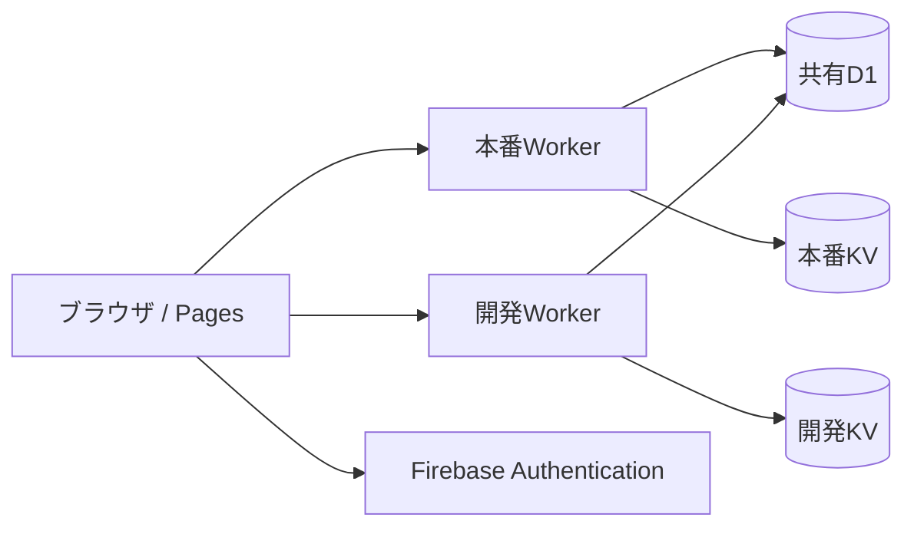

# システムアーキテクチャ

最終確認: 2026-10-04。リポジトリの実装・設定に基づく。本番の実リソースは未照合。

## 構成と仕様

Whereaboutsは、拠点内の在席状況、戻り時間、連絡先、明日の予定を共有するWebアプリ。名簿・列設定、休暇・行事、お知らせ、外部リンク集、CSV入出力、印刷、共有QRを備える。

- フロント: ルートの `index.html`、`main.js`、`js/`、`styles.css`、`print-list.css`。Cloudflare Pages配信を想定。
- API: `CloudflareWorkers_worker.js`。D1への読み書きはWorker経由。
- DB: Cloudflare D1。**本番・開発で同一DBを共有することは仕様**（2026-10-04にユーザー確認）。
- キャッシュ: Workers KV。本番・開発で別namespace。
- 認証: 拠点共有パスワードによるWorker署名セッションと、管理者向けFirebase Authenticationの併用。
- 初期化: `auth-guard.js`はhead内で同期実行。他のclassic scriptはHTML記載順のdefer。Firebase連携のみES module。
- Service Workerは新規登録しない。`sw.js`は旧配信資産として残存し、既存ブラウザへの影響確認後に退役を判断する。

```mermaid
flowchart LR
  Browser[ブラウザ / Pages] --> Prod[本番Worker]
  Browser --> Dev[開発Worker]
  Browser --> Auth[Firebase Authentication]
  Prod --> D1[(共有D1)]
  Dev --> D1
  Prod --> PKV[(本番KV)]
  Dev --> DKV[(開発KV)]
```

## 環境とデプロイ

| 項目 | 本番 | 開発 |
|---|---|---|
| Worker | whereabouts | whereabouts-dev |
| GitHub Actions | deploy-main.yml: main | deploy-dev.yml: dev / Dev_D1 |
| D1 | whereabouts-db（共有） | whereabouts-db（共有） |
| KV | 本番namespace | 開発namespace |
| Cron | 毎時 | 毎時 |
| 設定・在席キャッシュTTL | 604800秒 | 604800秒 |

`js/config.js`はホスト名でWorkerを選択する。`dev.`で始まるホスト、`localhost`を含むホスト、`127.0.0.1`は開発Worker。それ以外は本番Worker。ブランチ名による判定ではなく、PagesプレビューURLでは本番側になる場合がある。

KVの分離はD1の変更を隔離しない。開発側の書き込みは共有データを変更し、本番KVに古い値が残る可能性がある。これは共有仕様に対する運用・整合性設計の課題であり、DB分離は今回の計画に含めない。

## 共有D1の運用条件

1. 自動検証はローカルのモック／ローカルDBを使い、共有D1に接続しない。
2. 結合確認が必要なら共有DB内の試験専用拠点を明示し、対象office_idを固定する。
3. スキーマ変更は本番・開発両Workerに後方互換な追加から進める。バックアップ・復元手順を先に検証する。
4. 書き込み後に両環境の表示が整合する仕組みを設計する。KV削除だけで即時の強整合性を保証しない。
5. 同一DBへのCron二重実行を確認し、単一環境に処理を集約するか、冪等な実行記録で制御する。

## データと既存の制約

- `schema.sql`: offices / members / tools_config / notices / vacations / office_column_config / event_color_maps / users。
- Worker末尾のINITIAL_SCHEMAもsignup時の未初期化DB救済で実際に使用される。単純な未使用コードとして削除できない。
- 在席は通常30秒、夜間1時間、設定5分、行事10分の取得設定。`updated`による差分取得、ローカル復元・競合回復処理が存在する。
- Workerはクライアントの`baseRev`を条件更新に使用していない。クライアントの競合UIだけでは同時編集を保護できない。
- 詳細な指摘・検証範囲は [コードレビュー](CODE_REVIEW_2026-10-04.md)、今後の仕様は [開発計画](DEVELOPMENT_PLAN.md) を参照。
